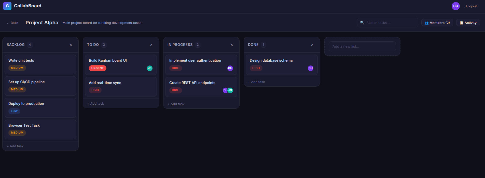

# Real-Time Task Collaboration Platform

A full-stack **Kanban board** application (Trello/Notion hybrid) with real-time multi-user collaboration, drag-and-drop task management, and activity tracking.

   

---

## 🚀 Quick Start

### Prerequisites

- **Node.js** v18+ 
- **MongoDB** running locally on `mongodb://localhost:27017` (or update `.env`)

### Setup & Run

```bash
# 1. Clone and navigate
cd Real-Time-Collaboration-Platform

# 2. Install backend dependencies
cd server
npm install

# 3. Seed demo data (optional but recommended)
node seed.js

# 4. Start backend server
npm run dev
# → Server runs on http://localhost:5000

# 5. Open a new terminal — install and start frontend
cd ../client
npm install
npm run dev
# → Frontend runs on http://localhost:5173
```

### Demo Credentials

| Email | Password |
|---|---|
| `demo@example.com` | `password123` |
| `demo2@example.com` | `password123` |

---

## 🏗️ Architecture

### System Overview

```
┌──────────────────┐     REST API      ┌──────────────────┐     Mongoose     ┌──────────┐
│   React Client   │ ◄──────────────► │  Express Server   │ ◄─────────────► │  MongoDB │
│   (Vite SPA)     │   Socket.IO       │  + Socket.IO     │                  │          │
└──────────────────┘                   └──────────────────┘                  └──────────┘
```

### Frontend Architecture

- **Framework**: React 18 + Vite (SPA)
- **Routing**: React Router v6 (Login, Signup, Dashboard, Board View)
- **State Management**: React Context + `useReducer`
  - `AuthContext` — user session, JWT token persistence
  - `BoardContext` — board/list/task state, reducer handles all mutations
- **Real-time**: Socket.IO client subscribes to board rooms
- **Drag & Drop**: `@hello-pangea/dnd` (maintained fork of react-beautiful-dnd)
- **HTTP**: Axios with JWT interceptor

**File Structure:**
```
client/src/
├── context/          # AuthContext, BoardContext (state management)
├── services/         # api.js (Axios), socket.js (Socket.IO)
├── pages/            # Login, Signup, Dashboard, BoardView
├── components/       # Navbar, BoardCard, TaskList, TaskCard,
│                     # TaskModal, SearchBar, ActivityFeed, MemberManager
├── App.jsx           # Router + route guards
├── main.jsx          # Entry point
└── index.css         # Complete design system
```

### Backend Architecture

- **Runtime**: Node.js + Express
- **Database**: MongoDB via Mongoose ODM
- **Auth**: JWT tokens + bcrypt password hashing
- **Real-time**: Socket.IO with JWT-authenticated connections
- **Pattern**: REST API endpoints + Socket.IO event broadcasting

**File Structure:**
```
server/
├── config/db.js      # MongoDB connection
├── middleware/auth.js # JWT verification
├── models/           # User, Board, List, Task, Activity
├── routes/           # auth, boards, lists, tasks
├── socket/index.js   # Socket.IO setup + room management
├── tests/            # Jest + Supertest
├── seed.js           # Demo data seeder
└── index.js          # Server entry point
```

---

## 📊 Database Schema

### Models

| Model | Key Fields | Indexes |
|---|---|---|
| **User** | name, email (unique), password (hashed) | email |
| **Board** | title, description, createdBy, members[] | createdBy, members |
| **List** | title, position, board | board + position |
| **Task** | title, description, position, list, board, assignees[], priority, dueDate | list + position, board, text(title, description) |
| **Activity** | action, board, task, user, details | board + createdAt |

### Relationships

- Board → has many Lists → has many Tasks
- Board → has many Members (Users)
- Task → has many Assignees (Users)
- Board → has many Activity entries

---

## 📡 API Documentation

All protected endpoints require: `Authorization: Bearer <JWT_TOKEN>`

### Authentication

| Method | Endpoint | Body | Response |
|---|---|---|---|
| `POST` | `/api/auth/signup` | `{name, email, password}` | `{token, user}` |
| `POST` | `/api/auth/login` | `{email, password}` | `{token, user}` |
| `GET` | `/api/auth/me` | — | `{user}` |
| `GET` | `/api/auth/users/search?q=` | — | `{users[]}` |

### Boards

| Method | Endpoint | Body | Description |
|---|---|---|---|
| `GET` | `/api/boards?page=&limit=` | — | List user's boards (paginated) |
| `POST` | `/api/boards` | `{title, description?}` | Create board |
| `GET` | `/api/boards/:id` | — | Board with lists & tasks |
| `PUT` | `/api/boards/:id` | `{title?, description?}` | Update board |
| `DELETE` | `/api/boards/:id` | — | Delete board + cascading |
| `POST` | `/api/boards/:id/members` | `{email}` | Add member |
| `DELETE` | `/api/boards/:id/members/:userId` | — | Remove member |
| `GET` | `/api/boards/:id/search?q=` | — | Search tasks |
| `GET` | `/api/boards/:id/activity?page=&limit=` | — | Activity log |

### Lists

| Method | Endpoint | Body | Description |
|---|---|---|---|
| `POST` | `/api/boards/:boardId/lists` | `{title}` | Create list |
| `PUT` | `/api/lists/:id` | `{title}` | Update list |
| `DELETE` | `/api/lists/:id` | — | Delete list + tasks |

### Tasks

| Method | Endpoint | Body | Description |
|---|---|---|---|
| `POST` | `/api/lists/:listId/tasks` | `{title, description?, priority?, dueDate?}` | Create task |
| `PUT` | `/api/tasks/:id` | `{title?, description?, priority?, dueDate?}` | Update task |
| `DELETE` | `/api/tasks/:id` | — | Delete task |
| `PUT` | `/api/tasks/:id/move` | `{listId, position}` | Move/reorder task |
| `PUT` | `/api/tasks/:id/assign` | `{userId}` | Assign user |
| `PUT` | `/api/tasks/:id/unassign` | `{userId}` | Unassign user |

---

## ⚡ Real-Time Sync Strategy

1. **Connection**: Clients connect via Socket.IO with JWT auth token
2. **Rooms**: Each board is a Socket.IO room (`board:<id>`). Clients join/leave on navigation
3. **Flow**: Client → REST API → DB mutation → HTTP response → Socket.IO broadcast to room
4. **Events**: `task:created`, `task:updated`, `task:deleted`, `task:moved`, `list:created`, `list:updated`, `list:deleted`, `member:added`, `member:removed`, `board:updated`, `board:deleted`
5. **Optimistic UI**: Drag-and-drop updates state instantly; rolls back on API failure

---

## 🧪 Testing

```bash
# Backend tests (Jest + Supertest)
cd server && npm test

# Frontend dev server (manual testing)
cd client && npm run dev
```

---

## 📈 Scalability Considerations

- **Socket.IO Redis Adapter**: For horizontal scaling across multiple Node processes
- **Database Indexes**: All query-heavy fields are indexed (compound indexes on list+position, board+createdAt)
- **Pagination**: All list endpoints support cursor/page-based pagination
- **Text Search Index**: MongoDB text index on task title/description for efficient search
- **Stateless Auth**: JWT tokens enable horizontal scaling without session storage
- **Code Organization**: Feature-based structure supports extraction into microservices

---

## ⚖️ Assumptions & Trade-offs

| Decision | Rationale |
|---|---|
| MongoDB over PostgreSQL | Flexible schema suits Kanban boards; embedded arrays for members/assignees |
| JWT (no refresh tokens) | Simpler auth flow; 7-day expiry. Production would add refresh tokens |
| `@hello-pangea/dnd` | Production-proven DnD library; accessible and well-maintained |
| Context + useReducer over Redux | Lighter weight for this app's complexity; collocated with components |
| Regex search over full-text | Works well for small-medium datasets; full MongoDB Atlas Search for production |
| Optimistic drag updates | Better UX; rollback on failure keeps consistency |
| No file upload | Kept scope focused on core collaboration features |

---

## 📁 Project Structure

```
Real-Time-Collaboration-Platform/
├── client/                 # React frontend (Vite)
│   ├── src/
│   │   ├── components/     # Reusable UI components
│   │   ├── context/        # State management
│   │   ├── pages/          # Route pages
│   │   ├── services/       # API & Socket clients
│   │   └── index.css       # Design system
│   └── package.json
├── server/                 # Express backend
│   ├── config/             # Database config
│   ├── middleware/          # Auth middleware
│   ├── models/             # Mongoose schemas
│   ├── routes/             # API routes
│   ├── socket/             # Socket.IO setup
│   ├── tests/              # API tests
│   ├── seed.js             # Demo data
│   └── package.json
└── README.md
```

